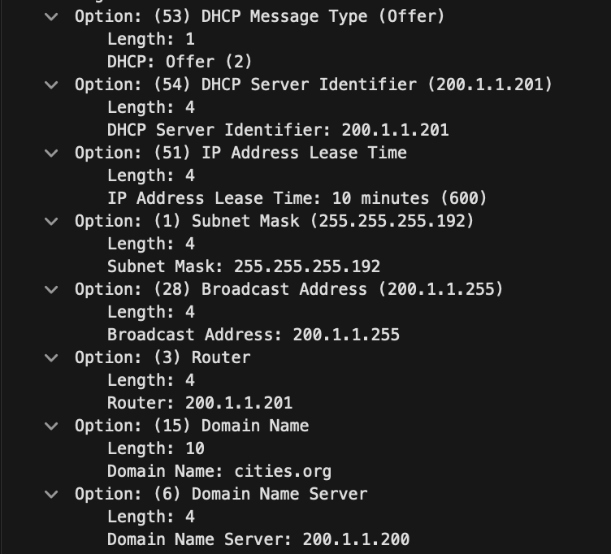

# EJ4

Analizar la captura de 01-dhcp.pcap

a) Indicar que mensajes DHCP se intercambian en el diálogo para obtener una dirección IP.

| #   | Message           | Source      | Destination             |
| --- | ----------------- | ----------- | ----------------------- |
| 1   | **DHCP Discover** | Client      | Broadcast               |
| 2   | **DHCP Offer**    | DHCP Server | Client / Broadcast      |
| 3   | **DHCP Request**  | Client      | DHCP Server / Broadcast |
| 4   | **DHCP ACK**      | DHCP Server | Client                  |

b) Indicar que direcciones físicas/MAC y lógicas/IP utiliza el mensaje Discover.

- **Direcciones físicas/MAC**:

  

  Source: 52:54:00:12:34:57

  Destination: Broadcast (ff:ff:ff:ff:ff:ff)

- **Direcciones lógicas/IP**:

  

  Source Address: 0.0.0.0

  Destination Address: 255.255.255.255

c) ¿Qué parámetros solicita para configuración automática el cliente?

d) ¿Cuál es la respuesta al mismo y qué valores le ofrece?

    (1)Subnet Mask
    (28)Broadcast Address
    (3)Router
    (15)Domain Name
    (6)Domain Name Server

e) ¿Qué direcciones físicas/MAC y lógicas/IP lleva la respuesta?

- **Direcciones físicas/MAC**:

  

  Source: 52:54:00:12:34:56

  Destination: 52:54:00:12:34:57

f) ¿Cómo identifica el servidor al cliente, por cuanto tiempo la dirección asignada la deberá tener el cliente antes de intentar renovarla? ¿Qué mensajes utiliza para renovar la dirección y cuáles son las posibles respuestas? ¿Qué direcciones lógicas y físicas utilizan estos
mensajes?

El servidor identifica al cliente a través de su MAC address enviada en el mensaje de request.

En el Offer, el campo "(51) IP Address Lease Time" indica que le asigna la IP por 10 minutos.

Para renovar la dirección, el cliente utiliza un Request. Si el servidor acepta la renovación envía un ACK.

g) ¿Qué protocolo de transporte utiliza DHCP y que puertos?

El protocolo DHCP utiliza UDP (User Datagram Protocol).

Los puertos involucrados son:

- Puerto 67: utilizado por el servidor DHCP.
- Puerto 68: utilizado por el cliente DHCP.

h) ¿Históricamente qué protocolo antecedieron a DHCP?

- BOOTP (Bootstrap Protocol) es el principal antecesor de DHCP. BOOTP también permitía a los clientes obtener una dirección IP automáticamente, pero no tenía la flexibilidad y las capacidades dinámicas de arrendamiento de direcciones que ofrece DHCP.
- Otro protocolo que antecedió, aunque de manera más simple, fue RARP (Reverse Address Resolution Protocol), que permitía a un dispositivo obtener su dirección IP conociendo solo su dirección MAC, pero este protocolo era limitado en funcionalidad.
