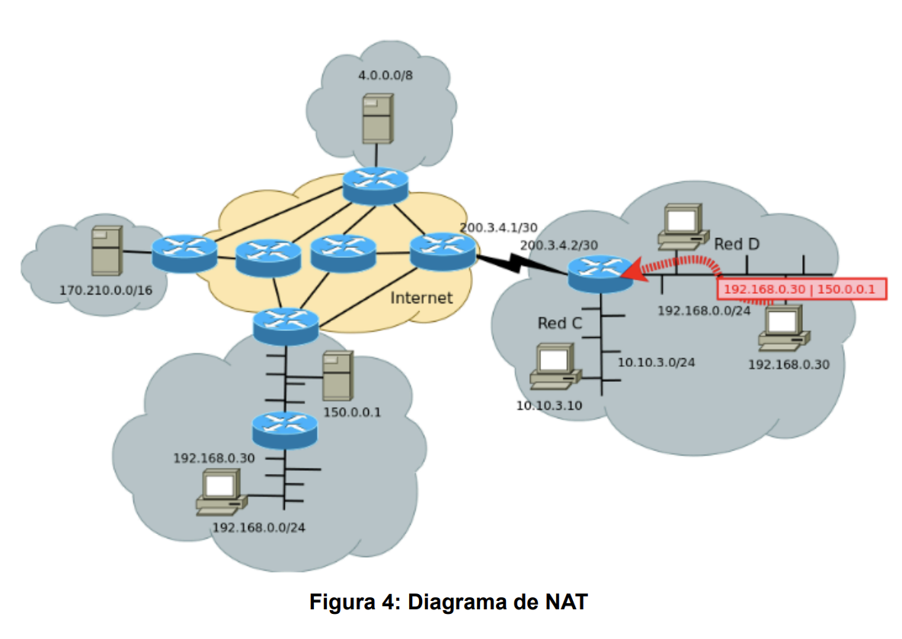
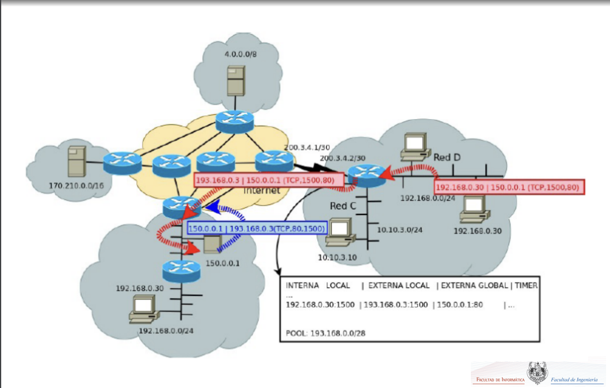

# EJ11

11. NAT Tradicional. Dado el diagrama de la figura 4.

    

    a) Escoger un bloque IPv4 público para que el router donde está ubicado el cliente pueda hacer una traducción uno a uno en la cual todos los posibles “clientes” de la red “D” puedan tener acceso simultáneo a Internet.

        red D: subred 192.168.0.0/24 (2^8 = 256 direcciones)

        El router debe tener al menos 256 direcciones públicas para realizar una traducción uno a uno (NAT estático).

        Un posible bloque de direcciones públicas sería 190.210.0.0/24

    b) Seleccionar un bloque para que solo el 25 % pueda tener acceso simultáneo. ¿Cómo se resolvería para que los restantes puedan tener acceso?

        256 * 0.25 = 64 = 2^6 direcciones

        El router necesita un espacio de 64 direcciones (6 bits de host).

        Un posible bloque de direcciones públicas sería 190.210.0.0/26

    c) Indicar cómo quedarıá la tabla de NAT del router si se hace traducción solo basada en IP cuando el cliente 192.168.0.30 quiere acceder al servidor web 150.0.0.1.

    | Interna      | Externa     |
    | ------------ | ----------- |
    | 192.168.0.30 | 190.210.0.1 |

    d) Indicar el posible encabezado que tendría el datagrama que entra al router desde el cliente y cómo sería el encabezado del datagrama que sale del router. ¿Qué campos cambiaron?

        Datagrama que entra al router (desde el cliente):
        - IP origen: 192.168.0.30
        - IP destino: 150.0.0.1

        Datagrama que sale del router (al servidor):
        - IP origen: 192.210.0.1
        - IP destino: 150.0.0.1

    e) Indicar el encabezado posible del paquete IP de la respuesta enviada desde el servidor y qué modificaciones necesita para que llegue al cliente.

        Paquete que enviado desde servidor (al router):
        - IP origen: 150.0.0.1
        - IP destino: 192.210.0.1

        Modificación por parte del router:
        - IP origen: 150.0.0.1
        - IP destino: 192.168.0.30

    f) ¿Cómo llegaría el datagrama si el router no tuviese activada funcionalidad de NAT, habría respuesta?

        preguntar: si el cliente envía un datagrama con su dirección privada y el router no la modifica, el servidor recibiría el mensaje pero no podría responderlo.

    g) ¿Qué mecanismo sería necesario si no se contase con el bloque IPv4 público y solo se tuviese una única IP pública en el router?

        Network Address Port Translation (NAPT): Extends NAT by translating not only IP addresses but also transport-layer ports, allowing multiple devices on a private network to share a single public IP address.

        Múltiples clientes dentro de la red privada comparten la misma IP pública, pero sus conexiones se diferencian por los números de puerto asignados.

    
